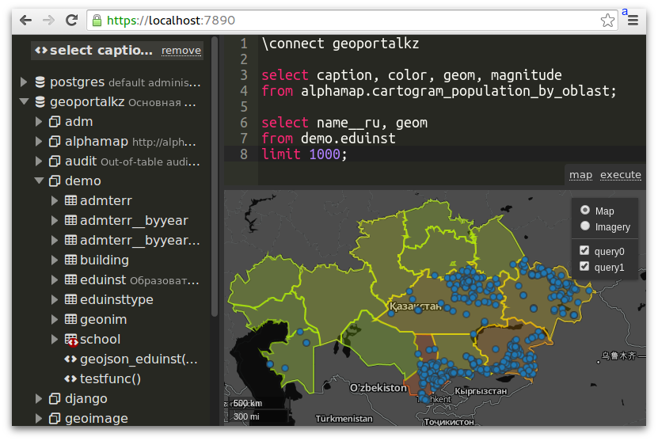

# pgBlackboard

Web interface for PostgreSQL

- Multi-statement scripts
- PostGIS support
- Inplace data editing



# Docker image

https://hub.docker.com/r/exedealer/pgblackboard

```
docker run -it --rm -p 7890:7890 exedealer/pgblackboard:20260104 pgbb postgres://HOST:PORT
```
